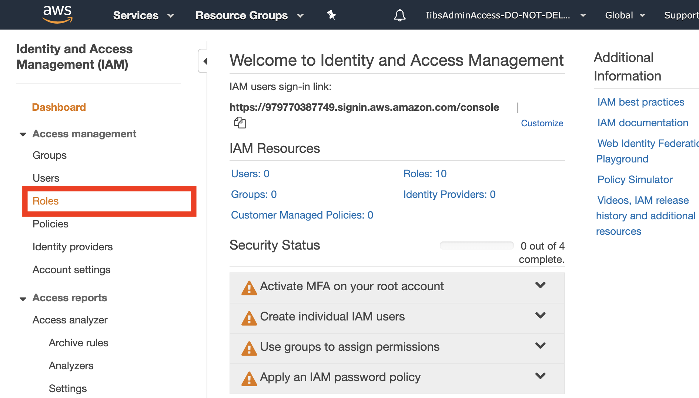
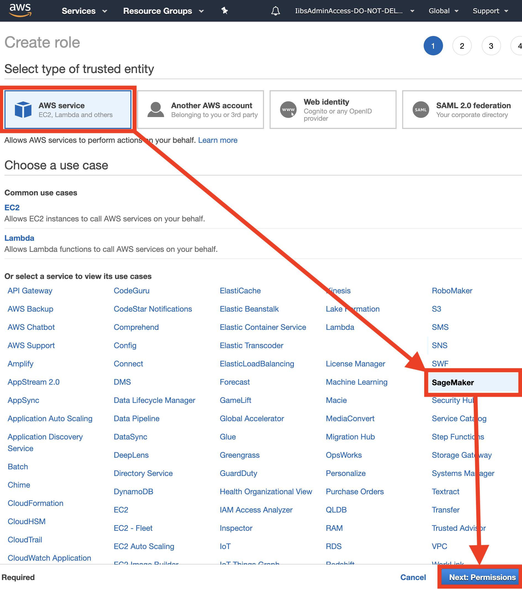
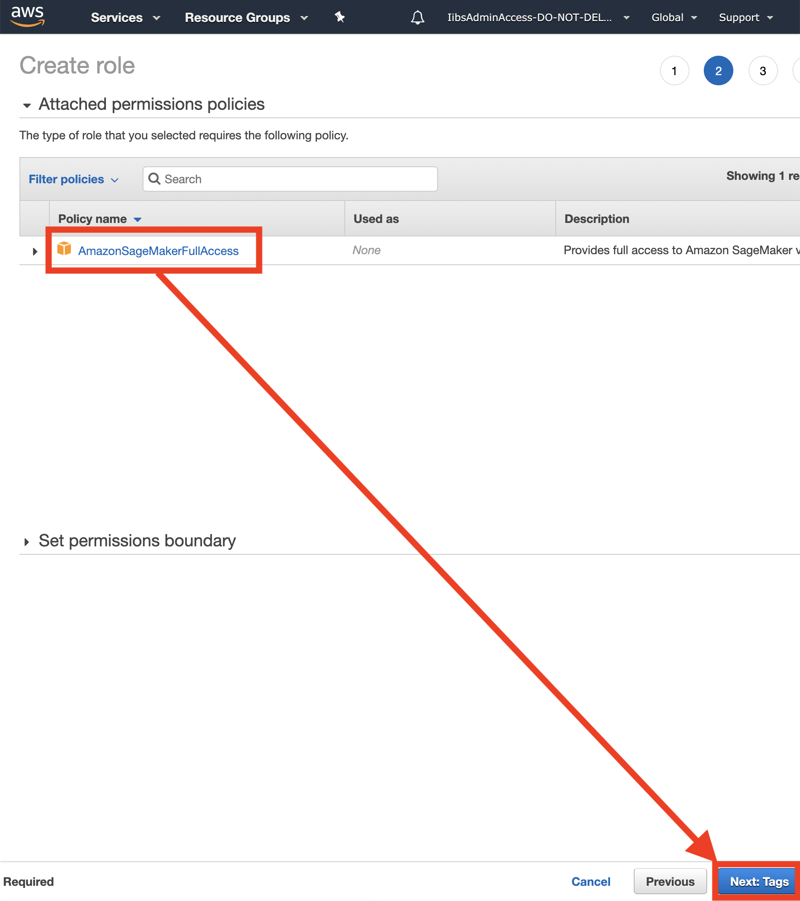
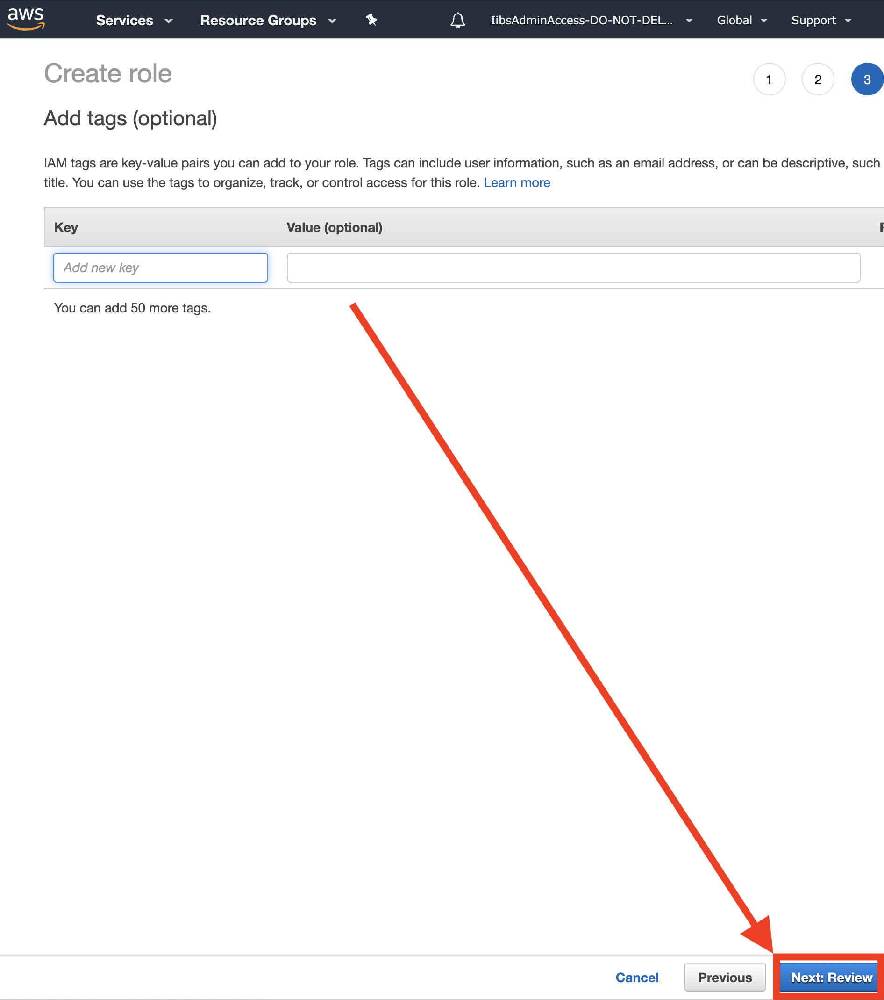
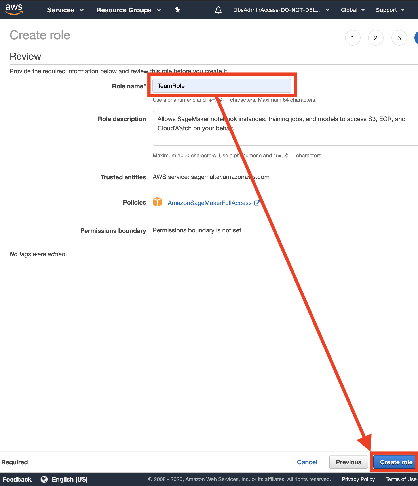
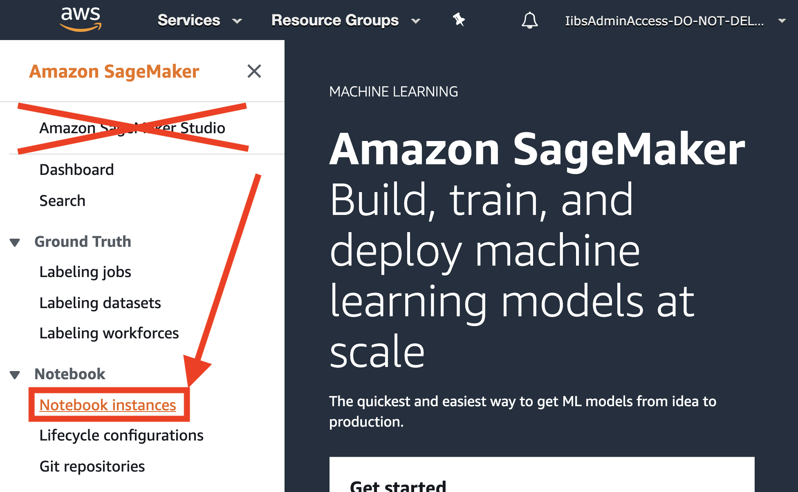
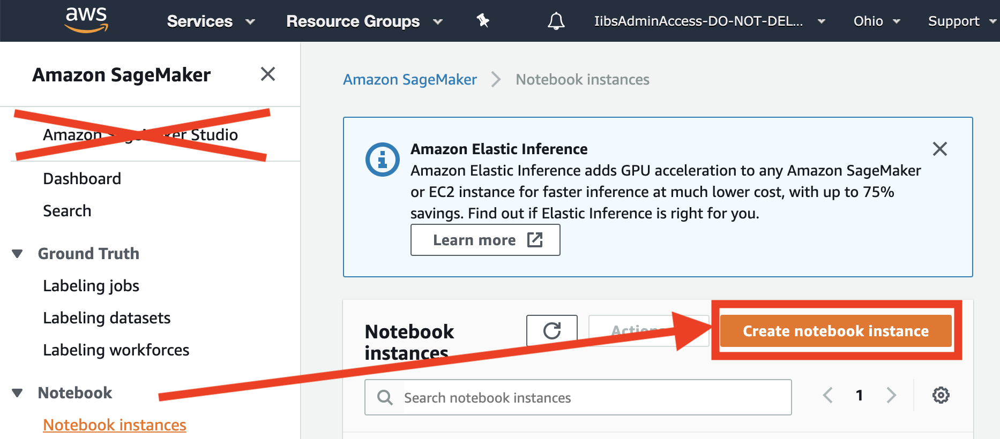
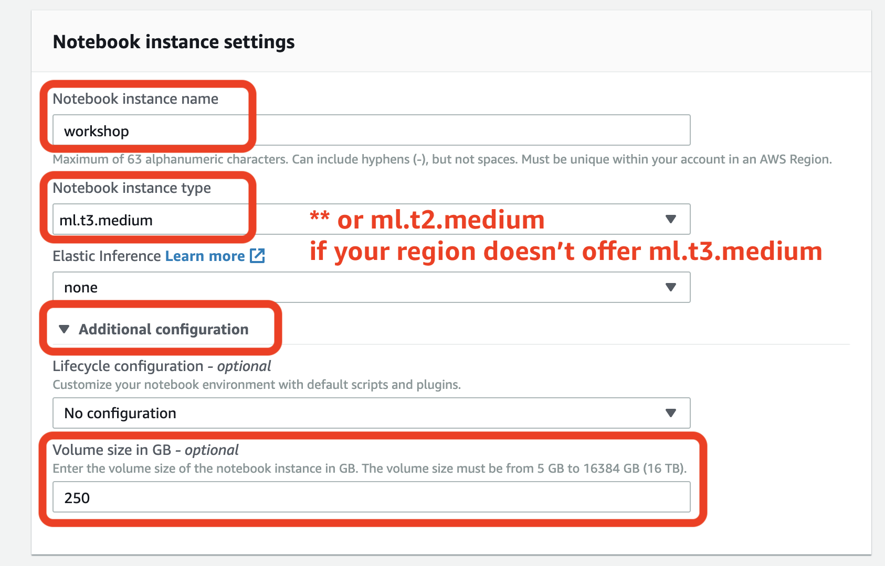
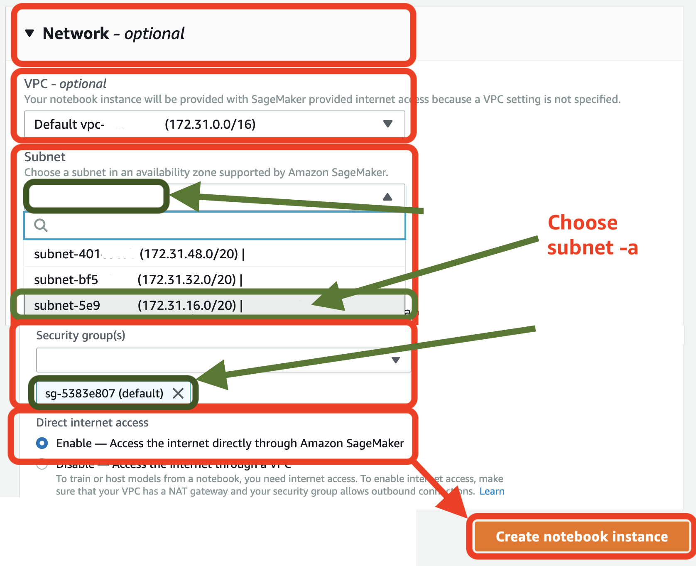

# Upcoming O'Reilly Book:  _Data Science on Amazon Web Services_
Register for early access directly on our [**website**](https://datascienceonaws.com).

_Influence the book by filling out our [**quick survey**](https://www.surveymonkey.com/r/798CMZ3)._

[](https://datascienceonaws.com)

# Workshop Instructions

## 1. Click on AWS Console

Take the defaults and click on **Open AWS Console**. This will open AWS Console in a new browser tab.


Double-check that your account name is something like `IibsAdminAccess-DO-NOT-DELETE...` as follows:


If not, please logout of your AWS Console in all browser tabs and re-run the steps above!

## 2. Create `TeamRole` IAM Role













## 3. Launch an Amazon SageMaker Notebook Instance

Open the [AWS Management Console](https://console.aws.amazon.com/console/home)


In the AWS Console search bar, type `SageMaker` and select `Amazon SageMaker` to open the service console.





In the Notebook instance name text box, enter `workshop`.

Choose `ml.t3.medium`. We'll only be using this instance to launch jobs. The training job themselves will run either on a SageMaker managed cluster or an Amazon EKS cluster.

Volume size `250` - this is needed to explore datasets, build docker containers, and more.  During training data is copied directly from Amazon S3 to the training cluster when using SageMaker.  When using Amazon EKS, we'll setup a distributed file system that worker nodes will use to get access to training data.



In the IAM role box, select the default `TeamRole`.


You must select the default `VPC`, `Subnet`, and `Security group` as shown in the screenshow.  Your values will likely be different.  This is OK.

Keep the default settings for the other options not highlighted in red, and click `Create notebook instance`.  On the `Notebook instances` section you should see the status change from `Pending` -> `InService`



While the notebook spins up, continue to work on the next section.  We'll come back to the notebook when it's ready.

## 4. Update IAM Role Policy

Click on the `notebook` instance to see the instance details.
`


Click on the IAM role link and navigate to the IAM Management Console.


Click `Attach Policies`.


              
Select `AmazonS3FullAccess` and click on `Attach Policy`.

_Note:  Reminder that you should allow access only to the resources that you need._ 


## 4. Start the Jupyter notebook

_Note:  Proceed when the status of the notebook instance changes from `Pending` to `InService`._


## 5. Launch a new Terminal within the Jupyter notebook

Click `File` > `New` > `Terminal` to launch a terminal in your Jupyter instance.


## 6. Clone this GitHub Repo in the Terminal

Within the Jupyter terminal, run the following:
```
cd ~/SageMaker && git clone https://github.com/data-science-on-aws/workshop
```


## 7. Navigate Back to Notebook View


## 8. Start the Workshop!
Navigate to `01_intro/` in your Jupyter notebook and start the workshop!


